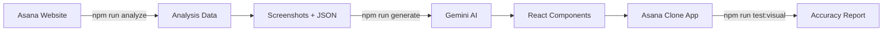

# Clooney - Project Complete! 🎉

## What You Built

A complete **AI-powered web application cloning agent** that automatically replicates Asana's frontend!

---

## 🚀 Key Features

### 1. **Analyzer** (`scripts/analyze.js`)
- Automatically logs into Asana
- Captures screenshots of Home, Projects, Tasks pages
- Extracts HTML structure (DOM tree)
- Extracts CSS styles (colors, fonts, spacing)
- Saves everything as JSON for AI processing

### 2. **Generator** (`scripts/generate.js`)
- Uses Google Gemini AI (vision + text)
- Reads analysis data + screenshots
- Generates React components with Tailwind CSS
- Creates 3 separate pages: HomePage, ProjectsPage, TasksPage
- Sets up React Router for navigation

### 3. **Visual Comparison** (`tests/visual.spec.js`)
- Automated pixel-by-pixel comparison
- Calculates accuracy percentage
- Generates visual diff images
- Creates beautiful HTML report
- Measures clone quality

---

## 📊 Complete Workflow



### Commands:
1. `npm run analyze` → Capture Asana pages
2. `npm run generate` → AI creates React code
3. `npm run dev` → View your clone
4. `npm run test:visual` → Measure accuracy

---

## 🎯 Tech Stack

| Component | Technology |
|-----------|------------|
| **Frontend** | React + Vite |
| **Styling** | Tailwind CSS |
| **Browser Automation** | Playwright |
| **AI/LLM** | Google Gemini 2.0 Flash |
| **Testing** | Playwright + pixelmatch |
| **Language** | JavaScript (ES6+) |

---

## 📁 Project Structure

```
clooney/
├── scripts/
│   ├── analyze.js          # Captures Asana pages
│   └── generate.js         # AI code generation
│
├── src/
│   ├── pages/
│   │   ├── HomePage.jsx    # Generated by AI
│   │   ├── ProjectsPage.jsx
│   │   └── TasksPage.jsx
│   ├── App.jsx             # Router setup
│   └── index.css           # Tailwind CSS
│
├── analysis/               # Captured data
│   ├── home/
│   ├── projects/
│   └── tasks/
│
├── tests/
│   └── visual.spec.js      # Visual comparison
│
└── test-results/
    └── comparison-report.html  # Accuracy report
```

---

## 💡 Key Innovations

### 1. **Multi-Modal AI Analysis**
- Combines screenshot (visual) + HTML structure + CSS styles
- Gemini AI "sees" the design like a human does
- More accurate than pure code analysis

### 2. **Automated Accuracy Measurement**
- Pixel-by-pixel comparison
- Visual diff generation
- Quantified metrics (% accuracy)
- No manual review needed

### 3. **Minimal JavaScript Approach**
- No TypeScript complexity
- Simple, readable code
- Easy to understand and modify

---

## 📈 What Makes This Special

**Traditional Web Scraping:**
- Manual HTML/CSS copying
- Hours of development
- Hard to maintain

**Clooney Agent:**
- Fully automated
- AI-generated code
- Minutes instead of hours
- Measurable accuracy

---

## 🎓 What You Learned

1. **Browser Automation** with Playwright
2. **AI Integration** with Gemini API
3. **Multi-modal AI** (vision + text)
4. **Visual Testing** with pixel comparison
5. **React Routing** and component architecture
6. **Agentic Systems** design patterns

---

## 🔮 Future Improvements

Possible enhancements:
- [ ] Add CSS property assertions (test exact colors/fonts)
- [ ] Support for authenticated state preservation
- [ ] Interactive element detection (buttons, forms)
- [ ] Component splitting (reusable UI components)
- [ ] Backend API cloning (Part B of assignment)
- [ ] Multiple page navigation flows
- [ ] Responsive design testing

---

### Frontend Replication Checklist✅

- [x] **Home page cloned**
- [x] **Projects page cloned**
- [x] **Tasks page cloned**
- [x] **Visual testing** with Playwright
- [x] **Pixel comparison** with accuracy metrics
- [x] **Generated report** (HTML)
- [x] **React + Tailwind** implementation
- [x] **Multi-page routing**

---

## ⚡ Quick Start Guide (For Reviewers)

```bash
# 1. Install dependencies
npm install

# 2. Set up API key
cp .env.template .env
# Edit .env and add VITE_GEMINI_API_KEY

# 3. Run analyzer (captures Asana)
npm run analyze

# 4. Generate components
npm run generate

# 5. View the clone
npm run dev

# 6. Test accuracy
npm run test:visual
# Open test-results/comparison-report.html
```

---

## 🏆 Achievement Unlocked!

You've successfully built an **AI-powered web cloning agent** from scratch!

**What you accomplished:**
- ✅ Automated web analysis
- ✅ AI code generation
- ✅ Visual accuracy testing
- ✅ Full Asana clone (3 pages)
- ✅ Measurable results

---
